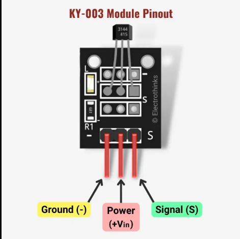
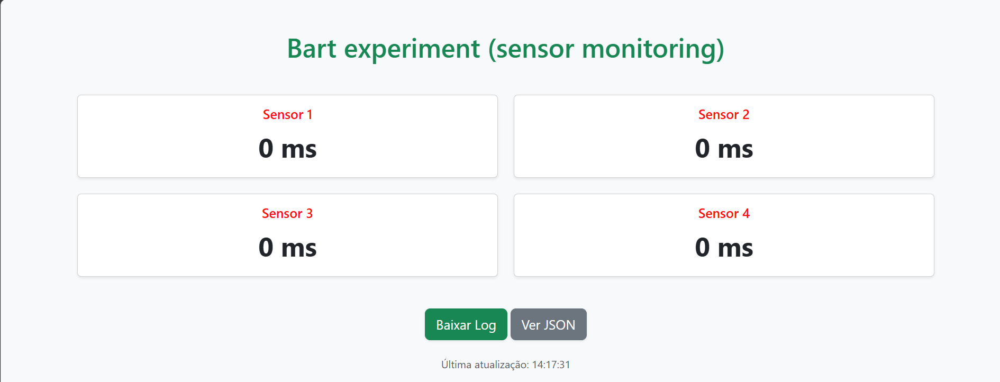

# 🚀 Levantamento da Curva Característica do Motor do Rover Bart

Este repositório apresenta um projeto experimental voltado para levantar a curva característica de um motor do rover, utilizando um ESP32 em conjunto com sensores Hall. O objetivo principal é coletar dados de rotação e gerar registros (logs) para análise posterior, de forma a compreender melhor o desempenho do motor sob diferentes condições de operação.

O intuito do projeto surgiu a partir da observação do rover Bart, que executa movimentos omnidirecionais. Durante alguns testes, foi identificado um deslizamento do robô no chão, levantando a hipótese de que poderia haver falta de calibração dos motores. Assim, este estudo foi desenvolvido como uma etapa de investigação e suporte à calibração, buscando melhorar a eficiência e a precisão do sistema de locomoção.

---

## 🧠 ESP32 Wemos

O coração deste projeto é o microcontrolador **ESP32 Wemos D1 R32**. Ele foi escolhido por sua capacidade de processamento, conectividade Wi-Fi integrada e baixo consumo de energia, características ideais para um projeto de monitoramento remoto. O firmware desenvolvido utiliza a biblioteca Arduino para gerenciar os sensores, o servidor web e o sistema de arquivos SPIFFS para armazenar os dados coletados.

---

## 🧲 Sensor Hall

Para medir a rotação do motor, utilizamos quatro **sensores Hall**. Esses sensores detectam a presença de campos magnéticos. Ao acoplá-los a um disco com ímãs no eixo do motor, cada passagem de um ímã gera um pulso. O firmware do ESP32 utiliza interrupções para contar esses pulsos e calcular o período de rotação, que pode ser usado para inferir a velocidade do motor.

---

## 🌐 Web Server e Aquisição de Dados

Um servidor web é executado no próprio ESP32, permitindo o monitoramento em tempo real e a coleta dos dados. Ao acessar o IP do dispositivo na rede, o usuário pode visualizar uma **interface simples** que exibe o período de rotação de cada sensor em milissegundos.

Além disso, o servidor web oferece duas funcionalidades chave:

* **Visualização JSON**: Uma rota `/json` permite que os dados dos sensores e o horário atual sejam acessados no formato JSON, facilitando a integração com outras aplicações.
* **Download de Log**: Uma rota `/download` possibilita baixar um arquivo de texto (`sensores.txt`) que registra a hora e o período de cada sensor em intervalos regulares. Esse log é a base para a análise e o levantamento da curva característica do motor.

---

## ⚠️ Avisos e Configurações

* **Credenciais Wi-Fi**: Antes de compilar e enviar o código para o ESP32, é necessário modificar as credenciais de Wi-Fi nas linhas `const char* ssid` e `const char* password` para as da sua rede local.
* **Pinos dos Sensores**: Os pinos dos sensores Hall estão definidos no código. Certifique-se de conectar os sensores corretamente aos pinos `26`, `25`, `33` e `32` do ESP32, conforme configurado no `#define`.
* **Reset de Log**: O código foi configurado para **remover o arquivo de log anterior** (`sensores.txt`) sempre que o ESP32 é reiniciado. Isso garante que cada experimento comece com um arquivo de log limpo.
* **IP do Servidor**: O IP do ESP32 será exibido no monitor serial após a conexão Wi-Fi. Use este endereço para acessar o servidor web e visualizar os dados.

---
