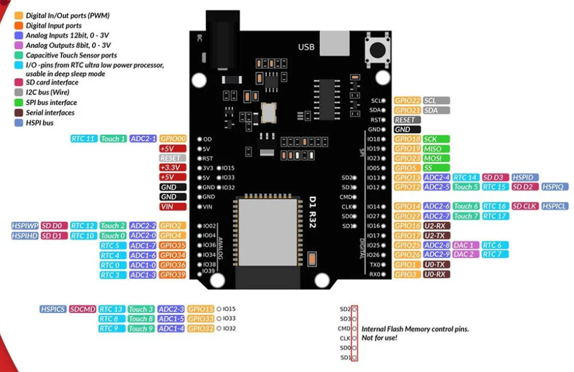
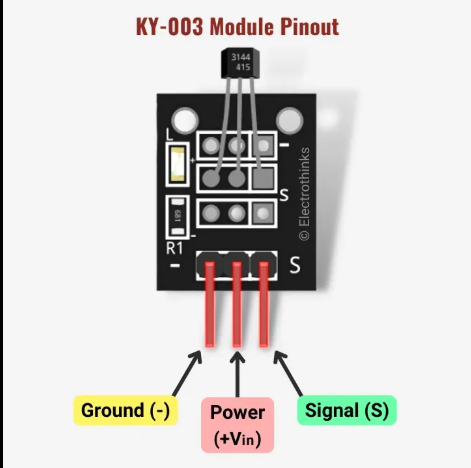
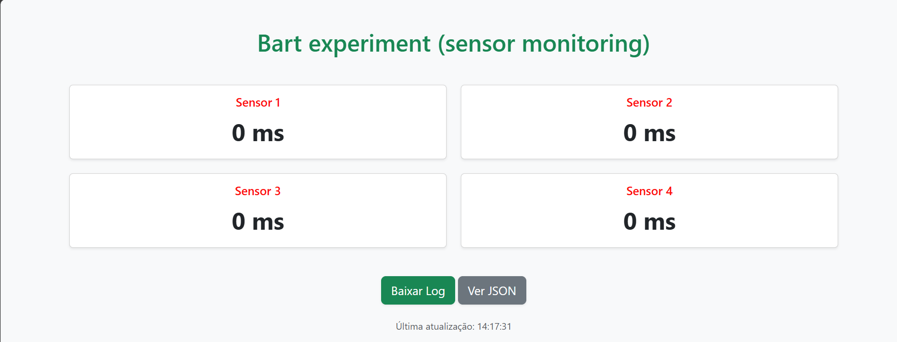

# 🚀 Levantamento da Curva Característica do Motor do Rover Bart

> 🌐 **Selecione o idioma / Choose your language**

<b>🇧🇷 Português (Brasil)</b>

 

Este repositório apresenta um projeto experimental voltado para levantar a curva característica de um motor do rover, utilizando um ESP32 em conjunto com sensores Hall. O objetivo principal é coletar dados de rotação e gerar registros (logs) para análise posterior, de forma a compreender melhor o desempenho do motor sob diferentes condições de operação.

O intuito do projeto surgiu a partir da observação do rover Bart, que executa movimentos omnidirecionais. Durante alguns testes, foi identificado um deslizamento do robô no chão, levantando a hipótese de que poderia haver falta de calibração dos motores. Assim, este estudo foi desenvolvido como uma etapa de investigação e suporte à calibração, buscando melhorar a eficiência e a precisão do sistema de locomoção.

---

## 🧠 ESP32 Wemos

O coração deste projeto é o microcontrolador **ESP32 Wemos D1 R32**. Ele foi escolhido por sua capacidade de processamento, conectividade Wi-Fi integrada e baixo consumo de energia, características ideais para um projeto de monitoramento remoto. O firmware desenvolvido utiliza a biblioteca Arduino para gerenciar os sensores, o servidor web e o sistema de arquivos SPIFFS para armazenar os dados coletados.

---

## 🧲 Sensor Hall

Para medir a rotação do motor, utilizamos quatro **sensores Hall**. Esses sensores detectam a presença de campos magnéticos. Ao acoplá-los a um disco com ímãs no eixo do motor, cada passagem de um ímã gera um pulso. O firmware do ESP32 utiliza interrupções para contar esses pulsos e calcular o período de rotação, que pode ser usado para inferir a velocidade do motor.

---

## 🌐 Web Server e Aquisição de Dados

Um servidor web é executado no próprio ESP32, permitindo o monitoramento em tempo real e a coleta dos dados. Ao acessar o IP do dispositivo na rede, o usuário pode visualizar uma **interface simples** que exibe o período de rotação de cada sensor em milissegundos.

Além disso, o servidor web oferece duas funcionalidades-chave:

* **Visualização JSON:** uma rota `/json` permite que os dados dos sensores e o horário atual sejam acessados no formato JSON, facilitando a integração com outras aplicações.
* **Download de Log:** uma rota `/download` possibilita baixar um arquivo de texto (`sensores.txt`) que registra a hora e o período de cada sensor em intervalos regulares. Esse log é a base para a análise e o levantamento da curva característica do motor.

---

## ⚠️ Avisos e Configurações

* **Credenciais Wi-Fi:** antes de compilar e enviar o código para o ESP32, é necessário modificar as credenciais de Wi-Fi nas linhas `const char* ssid` e `const char* password` para as da sua rede local. Além disso, a máquina que será utilizada para acessar o web server deve estar na mesma rede em que o ESP32 está conectado.
* **Pinos dos Sensores:** os pinos dos sensores Hall estão definidos no código. Certifique-se de conectar os sensores corretamente aos pinos `26`, `25`, `16` e `17` do ESP32, conforme configurado no `#define`.
* **Reset de Log:** o código foi configurado para **remover o arquivo de log anterior** (`sensores.txt`) sempre que o ESP32 é reiniciado. Isso garante que cada experimento comece com um arquivo de log limpo.
* **IP do Servidor:** o IP do ESP32 será exibido no monitor serial após a conexão Wi-Fi. Use este endereço para acessar o servidor web e visualizar os dados.
* **Conectando no Wi-Fi:** além do aviso de conectado no monitor serial, um segundo LED será aceso ao ser conectado na rede.
* **Biblioteca Arduino:** dentro da pasta `motor_code`, consta o código `.ino` e o `.zip` das bibliotecas necessárias para o funcionamento do código.

<b>🇺🇸 English</b>

 

This repository presents an experimental project aimed at obtaining the characteristic curve of a rover motor, using an ESP32 together with Hall sensors. The main objective is to collect rotation data and generate logs for later analysis, in order to better understand the motor's performance under different operating conditions.

The motivation for this project came from observing the Bart rover, which performs omnidirectional movements. During some tests, a slipping of the robot on the ground was identified, raising the hypothesis that there might be a lack of motor calibration. Thus, this study was developed as an investigation and calibration-support stage, aiming to improve the efficiency and precision of the locomotion system.

---

## 🧠 ESP32 Wemos

The heart of this project is the **ESP32 Wemos D1 R32** microcontroller. It was chosen for its processing capacity, integrated Wi-Fi connectivity, and low power consumption — ideal characteristics for a remote monitoring project. The developed firmware uses the Arduino library to manage the sensors, the web server, and the SPIFFS file system to store the collected data.

---

## 🧲 Hall Sensor

To measure the motor's rotation, we use four **Hall sensors**. These sensors detect the presence of magnetic fields. By coupling them to a disk with magnets on the motor shaft, each magnet pass generates a pulse. The ESP32 firmware uses interrupts to count these pulses and calculate the rotation period, which can be used to infer the motor's speed.

---

## 🌐 Web Server and Data Acquisition

A web server runs on the ESP32 itself, allowing real-time monitoring and data collection. When accessing the device's IP on the network, the user can view a **simple interface** that displays the rotation period of each sensor in milliseconds.

In addition, the web server offers two key features:

* **JSON Visualization:** a `/json` route allows the sensor data and the current time to be accessed in JSON format, facilitating integration with other applications.
* **Log Download:** a `/download` route allows downloading a text file (`sensores.txt`) that records the time and period of each sensor at regular intervals. This log is the basis for the analysis and the construction of the motor's characteristic curve.

---

## ⚠️ Notices and Settings

* **Wi-Fi Credentials:** before compiling and uploading the code to the ESP32, you must modify the Wi-Fi credentials in the `const char* ssid` and `const char* password` lines to match your local network. Additionally, the machine used to access the web server must be on the same network the ESP32 is connected to.
* **Sensor Pins:** the Hall sensor pins are defined in the code. Make sure to connect the sensors correctly to pins `26`, `25`, `16`, and `17` of the ESP32, as configured in the `#define`.
* **Log Reset:** the code is configured to **remove the previous log file** (`sensores.txt`) whenever the ESP32 is rebooted. This ensures each experiment starts with a clean log file.
* **Server IP:** the ESP32's IP will be displayed on the serial monitor after the Wi-Fi connection. Use this address to access the web server and view the data.
* **Connecting to Wi-Fi:** in addition to the connected notice on the serial monitor, a second LED will turn on when connected to the network.
* **Arduino Library:** inside the `motor_code` folder, you will find the `.ino` code and the `.zip` of the libraries required for the code to work.

